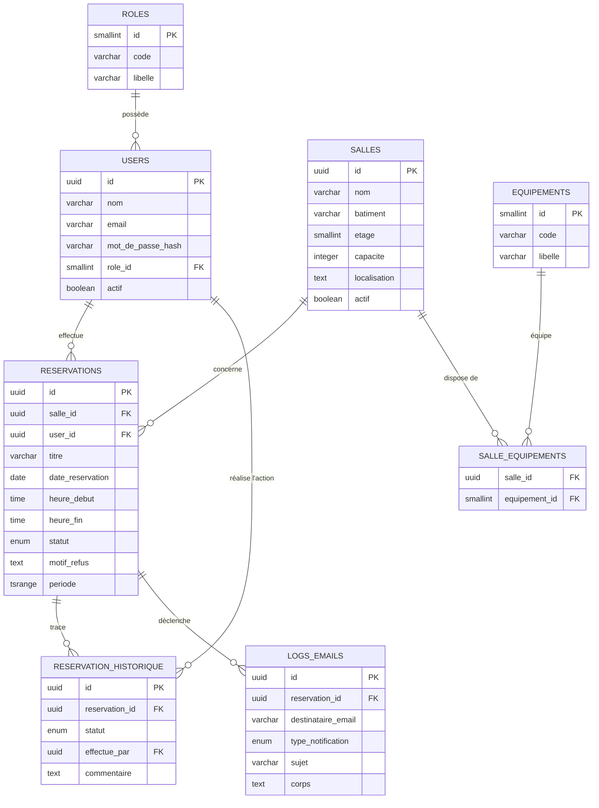

# SalleLibre — Architecture de base de données (PostgreSQL / Supabase)

Ce dossier contient l'architecture complète de la base de données destinée à
remplacer le stockage `localStorage` du prototype, conformément à TECH-02 de la
note de cadrage. Les scripts ont été **exécutés et validés sur un vrai moteur
PostgreSQL 16** (extensions `uuid-ossp` et `btree_gist` comprises) avant
livraison.

## Fichiers

| Fichier | Contenu |
|---|---|
| `01_schema.sql` | Extensions, types, tables, contraintes, index, triggers, vue |
| `02_seed.sql` | Rôles, utilisateurs, équipements, 11 salles, réservations de démo |

## 1. Diagramme relationnel



## 2. Détail des tables

### `roles`
Référentiel des 3 profils du projet. Clé primaire `SMALLINT` fixe (1, 2, 3)
plutôt qu'auto-incrémentée, pour pouvoir référencer les rôles par constante
dans le code back-end sans requête préalable.

### `users`
Comptes applicatifs. `mot_de_passe_hash` ne contient jamais de mot de passe en
clair — il est calculé côté back-end (bcrypt/argon2) avant insertion. La
contrainte `chk_users_email_format` fait une validation de premier niveau ; la
validation métier complète (unicité, format) reste du ressort du back-end.

### `salles`
Référentiel des salles (US-10). Le champ `actif` implémente une **suppression
logique** : désactiver une salle la retire de la recherche sans casser
l'intégrité référentielle des réservations passées qui la concernent (voir
choix `ON DELETE RESTRICT` ci-dessous). L'index unique partiel
`idx_salles_nom_actif` empêche deux salles actives de porter le même nom tout
en autorisant la réutilisation d'un nom après désactivation.

### `equipements` et `salle_equipements`
Modélisation en table de liaison N,N plutôt qu'un tableau ou une chaîne de
caractères sur `salles`. Cela permet :
- un filtrage combiné strict (`capacite >= 30 AND vidéoprojecteur AND visio`)
  via une jointure simple, sans parsing de texte ;
- l'ajout d'un nouvel équipement sans modifier le schéma ;
- un comptage/statistiques par équipement si besoin plus tard.

### `reservations`
Table centrale. Points clés :
- `statut` utilise le type énuméré `statut_reservation` (`confirmee`,
  `en_attente`, `refusee`, `annulee`) plutôt qu'une table de référence
  séparée : les valeurs sont fixes, connues à la conception, et un ENUM
  garantit l'intégrité tout en étant plus performant qu'une jointure
  supplémentaire sur chaque lecture.
- `periode` est une **colonne générée** (`GENERATED ALWAYS AS ... STORED`)
  combinant `date_reservation`, `heure_debut` et `heure_fin` en une plage
  `tsrange`. Elle n'est jamais renseignée manuellement : PostgreSQL la
  recalcule automatiquement à chaque insertion/modification.
- `excl_reservations_no_overlap` est la contrainte anti-conflit demandée
  (US-05), voir section 3 ci-dessous.

### `reservation_historique`
Journal d'audit du workflow de validation (US-03) : chaque changement de
statut (création, validation, refus, annulation) y est inscrit avec l'auteur
et un commentaire optionnel. Permet de reconstituer l'historique complet
d'une demande, y compris qui a validé ou refusé et quand.

### `logs_emails`
Traçabilité des notifications (US-06, TECH-04). Conserve le sujet et le corps
de chaque email envoyé, ainsi qu'un statut d'envoi (`envoye` / `echec`) pour
diagnostiquer une non-réception. En production, cette table est alimentée
après chaque appel réussi (ou échoué) à Nodemailer.

### `v_reservations_detail`
Vue de confort joignant `reservations`, `salles`, `users` et `roles`. Les
écrans Planning, Mes réservations, File d'attente et Tableau de bord peuvent
interroger cette vue directement plutôt que répéter les jointures dans
chaque requête applicative.

## 3. Moteur anti-conflit au niveau base de données (US-05)

Le prototype vérifiait les conflits en JavaScript. En production, la garantie
la plus sûre est de la pousser dans la base elle-même, pour qu'aucun accès
concurrent (deux requêtes simultanées) ne puisse créer un chevauchement,
même si le back-end a un bug :

```sql
CONSTRAINT excl_reservations_no_overlap EXCLUDE USING gist (
  salle_id WITH =,
  periode  WITH &&
) WHERE (statut IN ('confirmee', 'en_attente'))
```

Cette **contrainte d'exclusion** (`EXCLUDE`, disponible via l'extension
`btree_gist`) empêche l'insertion de deux réservations sur la **même salle**
(`salle_id WITH =`) dont les **plages horaires se chevauchent**
(`periode WITH &&`), et ce uniquement parmi les réservations actives
(`WHERE statut IN ('confirmee', 'en_attente')`) — une réservation refusée ou
annulée ne bloque plus le créneau.

Testé et confirmé sur PostgreSQL 16 :
- deux créneaux qui se chevauchent (même partiellement) → rejet automatique
  avec l'erreur `23P01 exclusion_violation` ;
- deux créneaux contigus (10h–11h puis 11h–12h) → acceptés, pas de faux
  positif ;
- un créneau identique à une réservation déjà **annulée** → accepté, le
  créneau est bien réutilisable.

Le back-end doit intercepter le code d'erreur PostgreSQL `23P01` et le
traduire en message utilisateur clair (« Ce créneau est déjà réservé »),
exactement comme le fait la fonction `createReservation()` du prototype.
Cette contrainte est un filet de sécurité en complément de la vérification
applicative, pas un remplacement : la vérification côté back-end reste
nécessaire pour renvoyer un message d'erreur propre avant même de solliciter
la base.

## 4. Choix `ON DELETE` (intégrité référentielle)

| Relation | Règle | Justification |
|---|---|---|
| `users.role_id → roles.id` | `RESTRICT` | Un rôle ne doit jamais être supprimé tant que des comptes l'utilisent. |
| `reservations.salle_id → salles.id` | `RESTRICT` | Empêche la suppression physique d'une salle ayant un historique de réservations ; utiliser `actif = false` (suppression logique) à la place. |
| `reservations.user_id → users.id` | `RESTRICT` | Préserve l'historique des réservations même si un compte doit être désactivé (`actif = false`) plutôt que supprimé. |
| `salle_equipements.salle_id / equipement_id` | `CASCADE` | Table de liaison pure : si une salle ou un équipement est supprimé, l'association n'a plus de sens et disparaît avec lui. |
| `reservation_historique.reservation_id` | `CASCADE` | L'historique n'a pas de raison d'exister sans la réservation qu'il documente. |
| `logs_emails.reservation_id` | `CASCADE` | Idem : le log est rattaché au cycle de vie de la réservation. |
| `reservation_historique.effectue_par → users.id` | `SET NULL` | Si le compte de l'auteur d'une action est supprimé, l'historique de l'action reste consultable (auteur devenu inconnu) plutôt que d'être perdu. |

En résumé : le CRUD des salles (US-10) doit être implémenté côté back-end
comme une bascule du champ `actif`, et non comme un `DELETE` physique, dès
qu'une salle a au moins une réservation associée. Le front-end du prototype
n'a pas à changer : l'API peut continuer à exposer un bouton « Supprimer »
qui, en interne, désactive la salle si elle a un historique, ou la supprime
réellement si elle n'a jamais été réservée.

## 5. Index créés et raison d'être

| Index | Usage |
|---|---|
| `idx_reservations_salle_date` | Recherche de disponibilité par salle et par jour (US-01, US-04, US-05) |
| `idx_reservations_statut` | File d'attente admin (US-03), filtrage du tableau de bord (US-08) |
| `idx_reservations_user` | Page « Mes réservations » (US-11) |
| `idx_reservations_date` | Vue planning, statistiques par jour (US-07, US-09) |
| `idx_salles_nom_actif` | Unicité des noms de salles actives |
| `idx_users_email` | Authentification (recherche par email au login) |
| `idx_salle_equipements_equipement` | Filtrage inverse « quelles salles ont cet équipement » |
| `idx_logs_emails_destinataire` / `idx_logs_emails_type` | Diagnostic des notifications par utilisateur ou par type |

## 6. Mise en place sur Supabase

1. Ouvrir le projet Supabase → **SQL Editor**.
2. Coller et exécuter `01_schema.sql` en premier.
3. Coller et exécuter `02_seed.sql` ensuite.
4. Vérifier avec `SELECT * FROM v_reservations_detail;`.

En ligne de commande (Supabase CLI ou `psql` directement sur la chaîne de
connexion fournie par Supabase) :

```bash
psql "postgresql://postgres:[MOT_DE_PASSE]@[HOTE_SUPABASE]:5432/postgres" -f 01_schema.sql
psql "postgresql://postgres:[MOT_DE_PASSE]@[HOTE_SUPABASE]:5432/postgres" -f 02_seed.sql
```

### Sécurité (Row Level Security)

Si l'authentification finale passe par **Supabase Auth** plutôt que par un
JWT maison (TECH-03 laisse les deux options ouvertes), il faudra activer le
Row Level Security sur les tables exposées à l'API publique (`salles`,
`reservations`) et écrire des policies du type :

```sql
ALTER TABLE reservations ENABLE ROW LEVEL SECURITY;

-- Un utilisateur ne voit que ses propres réservations...
CREATE POLICY reservations_select_own ON reservations
  FOR SELECT USING (user_id = auth.uid());

-- ...sauf le service Logistique, qui voit tout.
CREATE POLICY reservations_select_admin ON reservations
  FOR SELECT USING (
    EXISTS (
      SELECT 1 FROM users u
      WHERE u.id = auth.uid() AND u.role_id = 3
    )
  );
```

Cette section est fournie à titre indicatif : elle suppose que `users.id`
correspond à `auth.uid()`, ce qui n'est vrai que si Supabase Auth est
effectivement adopté. Avec un JWT maison (comme décrit dans TECH-03), le
contrôle d'accès par rôle reste géré par le middleware back-end, et le RLS
peut rester désactivé tant que la base n'est interrogée que par ce back-end
de confiance.

## 7. Correspondance avec le prototype `localStorage`

| Fonction du prototype (`src/lib/db.js`) | Équivalent SQL |
|---|---|
| `searchRooms()` | `SELECT ... FROM salles LEFT JOIN salle_equipements ... WHERE capacite >= $1 AND actif = true` puis filtrage de disponibilité via anti-jointure sur `reservations` |
| `createReservation()` | `INSERT INTO reservations (...)`, la contrainte `EXCLUDE` remplace la vérification manuelle des conflits |
| `validateReservation()` / `rejectReservation()` | `UPDATE reservations SET statut = ...` + `INSERT INTO reservation_historique` |
| `cancelReservation()` | `UPDATE reservations SET statut = 'annulee'` + `INSERT INTO reservation_historique` |
| `computeStats()` | Agrégations `SUM`/`COUNT`/`GROUP BY` sur `v_reservations_detail` |
| `exportReservationsCSV()` | Même requête que le tableau de bord, formatée en CSV côté back-end ou via `COPY (...) TO STDOUT WITH CSV HEADER` |
| `sendMail()` | Appel Nodemailer réel + `INSERT INTO logs_emails` |
